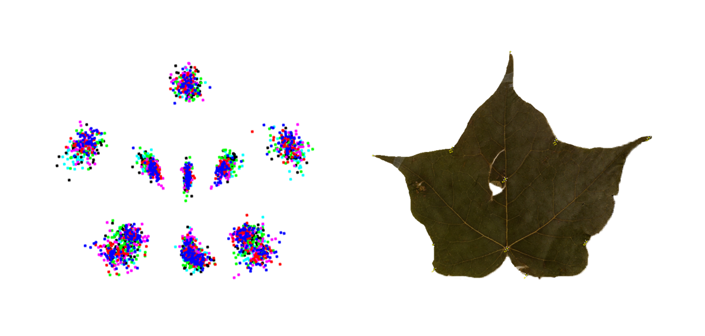

## Scripts for some simple morphometric analyses

### The issue at hand, in other words

The code included here was written for a specific, telic purpose. My advisor (Dr. Andrew Hipp, Morton Arboretum) asked me to present a set of geometric morphometric analyses on two species of *Acer* section *Acer* series *Saccharodendron* (hard maples, Sapindaceae, Plantae), work following that from one of my other classes this quarter, Morphometrics (with Dr. Mark Webster). Comparing the two most widespread species in this group, *Acer saccharum* Marsh. and *Acer nigrum* Michx. f., the upshot of my presentation was that species identity as currently defined explains a greater amount of leaf shape variation than do differences within species, including regional identity.

However, in the process of running through many of the same analyses two times over, I realized quite well what portion of it that I had accomplished through R was done via extremely clunky and ill-organized code. I realized the necessity of generalizing and being able to edit graphs, change group membership, and so on. I thus undertook rewriting and expanding my R scripts in the name of reproducibility and legibility.

### A general approach, or something like it

It is a little difficult to describe the approach I took to this code when much of what I did was dictated by two limitations: my knowledge of shape analysis, and my understanding of the specialized functions used to execute such analyses. In the end, this project involved a far greater number of highly specific internet searches than even my normal attempts at coding. In particular, those functions particular to the analysis of shape in two dimensions (as described by landmark coordinate data) required a fair bit of digging to understand, let alone implement. Geometric

Most of the analyses used here remain as relevant as ever, but originate over a decade ago. I was frequently unable to translate matters into the "grammar of graphics", especially for functions set in stone (or at least baked into brick) that generate plots that resemble base graphics in R. In the end, I elected to stick with base graphics for everything, preserving simple options for color and usually using semi-manual selection of input data for graphs.

I did my best to make complicated and regular operations legible, creating a small (but critical) loop for reading data, as well as some short pipes for data conversion. Ultimately, however, my last round of cleanup got rid of vast amounts of superfluous code -- the longest, messiest pipes are now gone entirely, for example. It is hard not to feel that my brief final scripts look a little unimpressive, but I would at least like to think of their current appearance as a sign of improvement and simplicity.

### Looking backward, looking ahead

The simultaneous learning curve for understanding geometric morphometrics (to me, mathematically new) and working in R (in which I began as less than a novice, let alone in any other language) was too steep for me to climb to the top. As I write this, I am probably -- by others' estimation -- still trudging somewhere in the foothills of basic understanding, far from any ascent toward general mastery.

My answers to the original issue, as presented here, are neither extensive nor elegant. I feel certain I could have accomplished somewhat more, or simply accomplished somewhat *differently*. Nevertheless, I solved a practical problem of a given moment, with meaningful output -- the task upon which I set out in the first place. I leave up to judgment the specific flaws (and any potential merits) of the code I used to get there.

#### How (best) to run these scripts

1. Please set your working directory to the WORKING folder. Originally the plots generated from the third script also autosaved to this folder, but I have opted not to make them do so due to inconsistent graphics-related errors encountered in that process (everyone's system is different as well).

2. Source the Claude functions. (This is also done at the beginning of Script 1, "01.importData.R".)
  + PLEASE NOTE that these are functions taken from "Morphometrics with R" by Julien Claude, 2008. Thanks to Mark Webster for putting together the original full list of them.
  + I only include here those that I personally rely on in the subsequent scripts; I have edited them for legibility, but as they are not my original work, consult the original source for full description of their utility, among much more information.

3. Subsequent scripts are largely self-explanatory.
  + Script 1 ("01.importData.R") imports six datasets containing maple leaf landmark coordinates.
  + Script 2 ("02.landmarkMorphometrize.R") conducts superimpositions and statistical analyses of the read-in data.
  + Script 3 ("03.plotOutput.R") contains some example of code generating individual graphs (and is the least polished due to reliance on base R graphics, but as stated, that's another matter).
  

